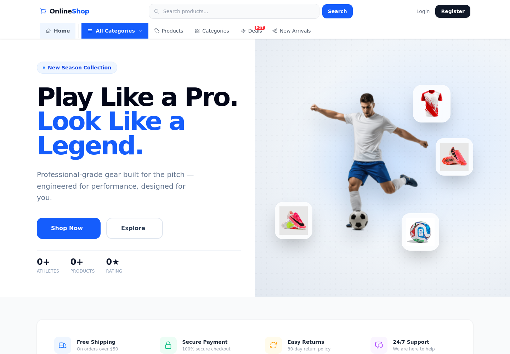
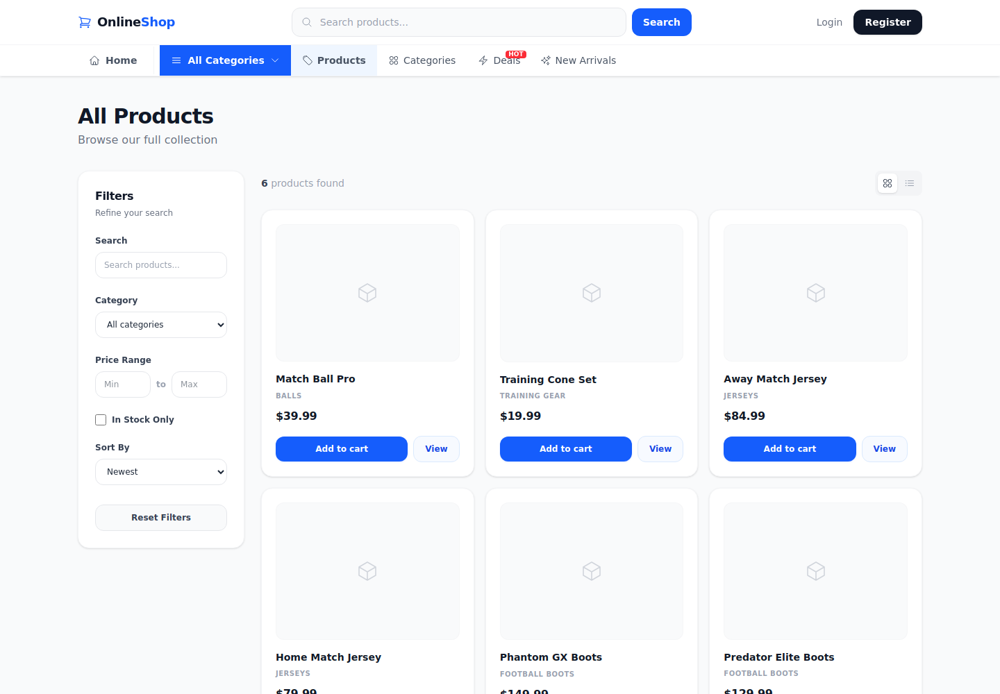
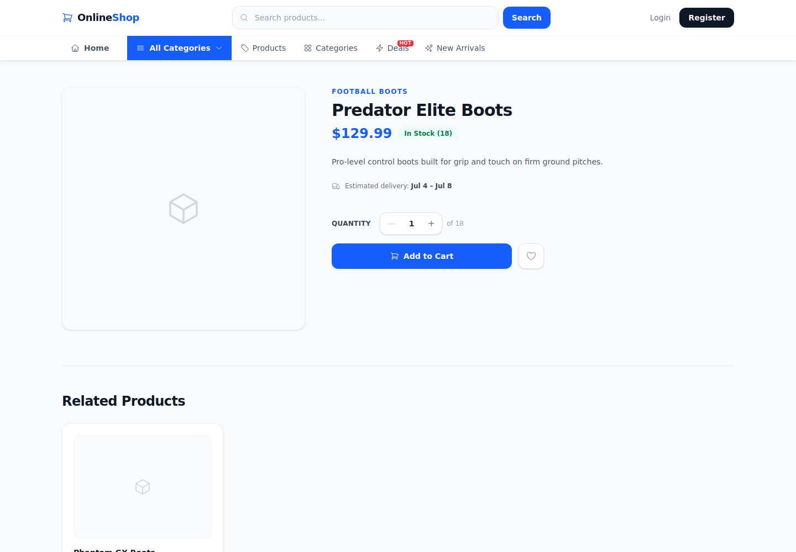

# Online Shop — Frontend (Vue 3)

The storefront client for **Online Shop**, a football/soccer equipment e-commerce site. Built with **Vue 3 (Composition API)**, **Vite**, **Pinia**, **Vue Router**, and **Tailwind CSS v4**, consuming the [Laravel API backend](../backend/README.md).


*Live screenshot of the homepage — hero banner, category navigation, and feature strip.*

## Tech Stack

- **Vue 3** — `<script setup>` / Composition API
- **Vite** — dev server & build tool
- **Pinia** — state management (auth, cart, stats stores)
- **Vue Router 4** — client-side routing
- **Tailwind CSS v4**
- **Axios** — API client
- **@heroicons/vue** — icon set

## Screenshots

**Product listing** — filters, sorting, and grid/list view toggle:



**Product detail** — quantity selector, stock status, and related products:



## Features

- Product browsing with filters, categories, deals, and new arrivals
- Full-text product search with a dedicated results page
- Product detail pages with media gallery, meta info, and reviews
- Cart and wishlist, backed by Pinia stores
- Checkout flow (address → payment → summary → success) with post-order review prompt
- Order history and order detail views, with cancellation
- Email/password auth plus **Google Sign-In** (OAuth callback route)
- User profile management (info + password)
- Toast notifications, skeleton loading states, and a responsive layout

## Project Structure

```
frontend/
├── src/
│   ├── api/            # Axios instance/config
│   ├── services/        # authService, productService, cartService, orderService, ...
│   ├── stores/           # Pinia stores: auth, cart, stats
│   ├── router/           # Vue Router routes
│   ├── layouts/          # MainLayout
│   ├── components/       # Feature-organized: home/, products/, cart/, checkout/, orders/, profile/, common/, auth/
│   ├── views/             # Route-level pages (Home, Products, ProductDetail, Cart, Checkout, Orders, Profile, Login, ...)
│   ├── App.vue
│   ├── main.js
│   └── style.css
├── public/
│   └── images/            # Static assets (hero image, product placeholders)
├── vite.config.js
└── .env                    # VITE_API_BASE_URL, VITE_GOOGLE_CLIENT_ID
```

## Prerequisites

- Node.js 18+
- npm
- The [backend API](../backend/README.md) running (default `http://127.0.0.1:8000`)

## Setup

```bash
# 1. Install dependencies
npm install

# 2. Configure environment (.env is already included, adjust as needed)
# VITE_API_BASE_URL=http://127.0.0.1:8000
# VITE_GOOGLE_CLIENT_ID=<your-google-client-id>

# 3. Run the dev server
npm run dev
```

The app runs at `http://127.0.0.1:5173` by default.

## Environment Variables

| Variable | Purpose |
|---|---|
| `VITE_API_BASE_URL` | Base URL of the Laravel API |
| `VITE_GOOGLE_CLIENT_ID` | Google OAuth client ID (mirrors backend's `GOOGLE_CLIENT_ID`) |

## Available Scripts

| Command | Description |
|---|---|
| `npm run dev` | Start the Vite dev server with hot reload |
| `npm run build` | Build for production |
| `npm run preview` | Preview the production build locally |

## Code Style

- **Composition API only** for components and Pinia stores (no Options API)
- `for` loops preferred over array methods like `reduce`/`filter`/`find` for control flow-heavy logic
- `return` used to exit loops early instead of `break`
- Single-attribute HTML elements collapsed to one line

## Related

- [Backend README](../backend/README.md) — Laravel API this app talks to